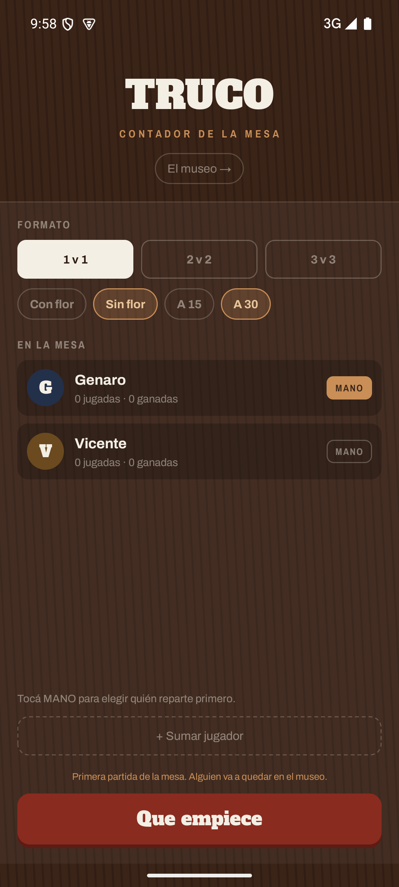
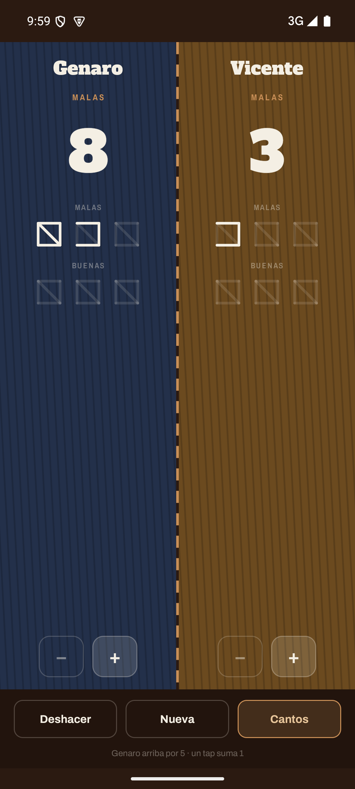
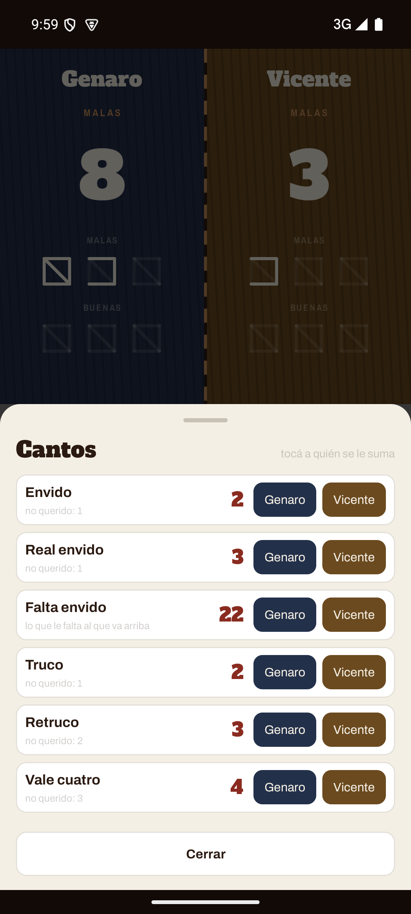
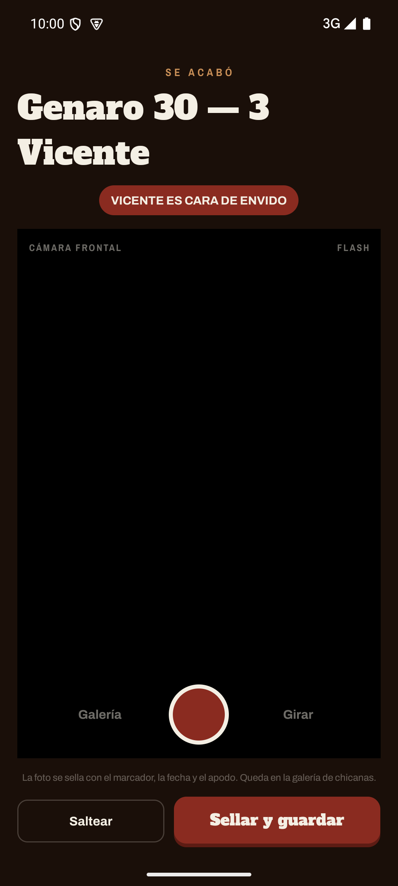
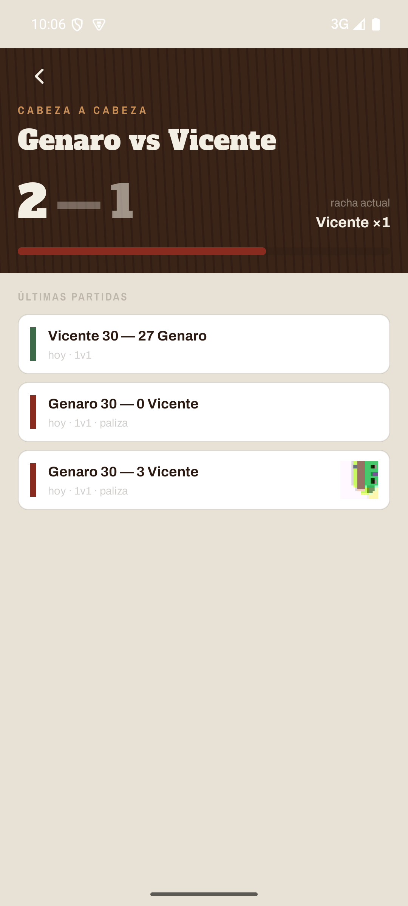
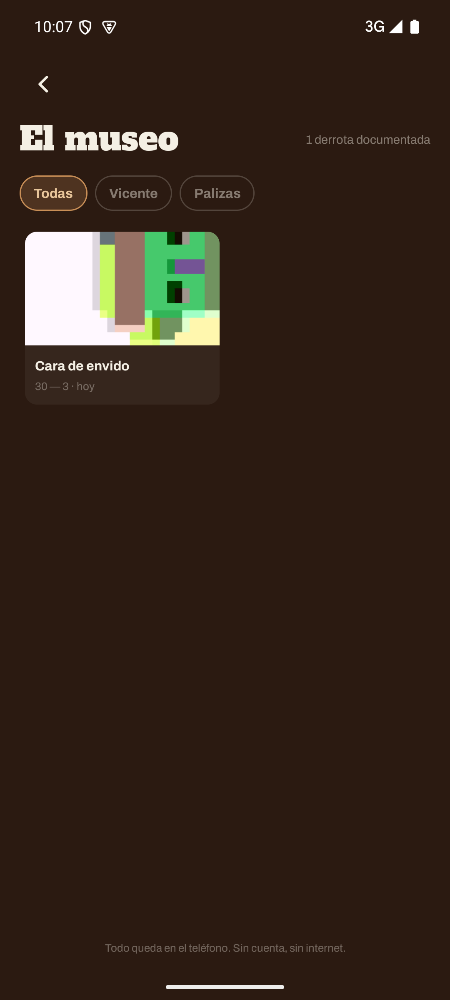
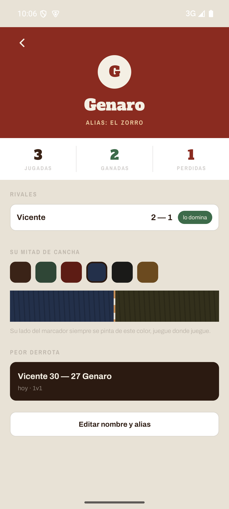
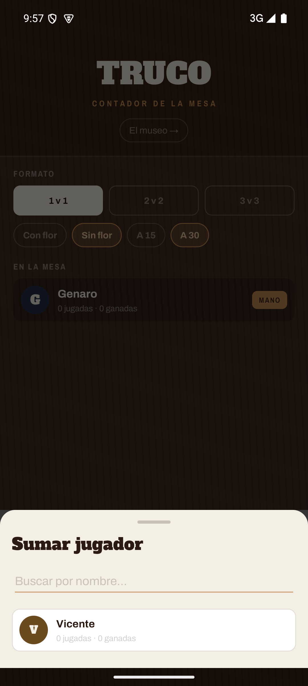

# Buenas y Malas

Contador de truco para Android. Offline de punta a punta: sin cuentas, sin backend, sin
permiso de internet. Lleva el marcador con los cuadraditos clásicos de la mesa —cuatro
palitos y una diagonal, cinco puntos—, guarda el historial cabeza a cabeza entre los que
juegan siempre, y le saca una foto al perdedor para el museo de las chicanas.

Android nativo en **Java**, Views + XML. El marcador es un `CustomView` que dibuja los
trazos de tiza con `Canvas`.

## Estado

En construcción. Ver [CHANGELOG.md](CHANGELOG.md).

## Pantallas

<table>
<tr>
<td width="25%"><br><b>Armar la mesa</b><br>Formato, reglas, quiénes juegan (con buscador de jugadores existentes) y quién es mano.</td>
<td width="25%"><br><b>Marcador</b><br>Un tap en la mitad de un equipo suma un punto.</td>
<td width="25%"><br><b>Cantos</b><br>Envido, truco, flor y sus valores; se toca a quién se le suman.</td>
<td width="25%"><br><b>Fin de partida</b><br>Cámara para la foto del perdedor, sellada con el marcador.</td>
</tr>
<tr>
<td width="25%"><br><b>Cabeza a cabeza</b><br>Historial entre dos jugadores: récord, racha y últimas partidas.</td>
<td width="25%"><br><b>El museo</b><br>Galería de las fotos, filtrable por jugador o por paliza.</td>
<td width="25%"><br><b>Perfil</b><br>Stats, rivales, apodo y el color de su mitad de cancha.</td>
<td width="25%"><br><b>Sumar jugador</b><br>Busca entre los que ya jugaron antes; si no hay coincidencia, crea uno nuevo.</td>
</tr>
</table>

El diseño de referencia está en [`design/`](design/): `Contador de Truco.dc.html` es el
prototipo navegable (abrilo en el navegador) y `HANDOFF.md` la especificación visual.

## Compilar

Requiere JDK 17+ y el Android SDK (Platform 35, Build-Tools, Platform-Tools).

```bash
./gradlew assembleDebug     # APK de debug
./gradlew test              # tests unitarios
./gradlew installDebug      # instalar en el dispositivo conectado
```

En Windows, `gradlew.bat`. Si el SDK no está en la ruta por defecto, apuntalo en
`local.properties` con `sdk.dir=C\:\ruta\al\Sdk`.

## Decisiones y patrones

**Arquitectura.** MVVM: `MatchViewModel` con `SavedStateHandle` sostiene el estado de la
partida en curso, así sobrevive a la rotación y a que el sistema mate el proceso. Una sola
`Activity` con Navigation Component y un `Fragment` por pantalla. Room detrás de un
`TrucoRepository` único, con las lecturas como `LiveData` y las escrituras en un
`ExecutorService` de un hilo.

**El marcador es un `CustomView`.** `ScoreBoardView` dibuja en `onDraw` dos filas —malas y
buenas— de tres cuadrados, cada uno con sus cinco trazos: los cuatro lados y la diagonal.
Los trazos todavía no ganados se pintan al 13% de opacidad, como marcas tenues de tiza.
Hacerlo con `Canvas` en vez de con vistas anidadas es lo que permite animar la aparición
del último trazo y escalar la geometría a cualquier densidad sin recursos por dpi.

**Modo a 15.** Malas son los puntos 1 a 15 y buenas del 16 al 30, con tres cuadrados de
cinco cada fila. En una partida a 15 se ocupan sólo las malas y se gana al completarlas:
la misma vista sirve para los dos modos, sin cuadrados partidos ni geometría especial.

**Historial de 2v2 y 3v3, por jugador y por equipo.** Cada partida suma victoria o derrota
a cada integrante, así que el cabeza a cabeza entre dos personas incluye todas las partidas
donde estuvieron en lados opuestos, sea cual sea el formato. Además, cada equipo guarda un
`rosterKey` —los ids de sus jugadores ordenados— que le da identidad estable a la dupla
entre partidas y permite el récord de la dupla armada.

**La foto se sella al mostrarla, no al guardarla.** El archivo queda crudo en el
almacenamiento interno y el marcador, la fecha y el apodo se dibujan encima al renderizar.
Si mañana cambia el apodo del perdedor, cambia en todas sus fotos.

**Offline por diseño.** El único permiso que pide la app es `CAMERA`. No declara
`android.permission.INTERNET`: aunque quisiera, no puede llamar a ningún lado.

## Licencia

MIT. Ver [LICENSE](LICENSE).
